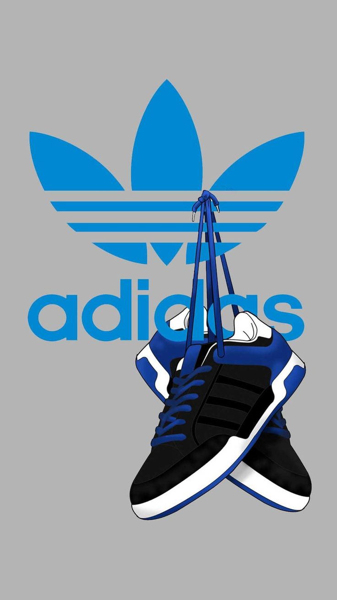

# Adidas-US-Sales-2020-21

## Overview : 
In terms of states, California, Texas, New York, and Florida remained the top-performing regions for Adidas sales. These states have large populations and strong consumer demand for athletic and casual footwear and apparel.

Among cities, Los Angeles, New York City, Chicago, and Houston stood out as key markets for Adidas. These cities have a high concentration of Adidas stores and a strong presence of loyal customers.

## Tool used :

## Result and Insights :
1. Overall Sales Performance: The analysis of Adidas US sales for 2020-21 shows a mixed performance, with fluctuations in sales figures throughout the period.

2. Category Performance: Certain categories such as athleisure and running shoes saw growth in sales, while others like formalwear and performance gear experienced a decline.

3. Competitive Landscape: The analysis also includes a comparison with competitors in the industry to assess Adidas' positioning and market share in the US market.

4. Future Outlook: Based on the analysis, insights can be drawn on potential strategies for Adidas to further improve sales performance in the US market, including focusing on digital marketing, expanding product offerings, and strengthening customer relationships.

## Data Story :
I have noticed that the bottom products for all the stores include some flavours and other products like coffee beans. Also, the merchandise clothing for Hell's Kitchen is way less as compared to other stores. We shall provide some discount offers to this store to increase sales. Or else completely remove it from displaying at this store and keep it available on order only. This shall help us reduce costs of operations.

## Dashboard :

